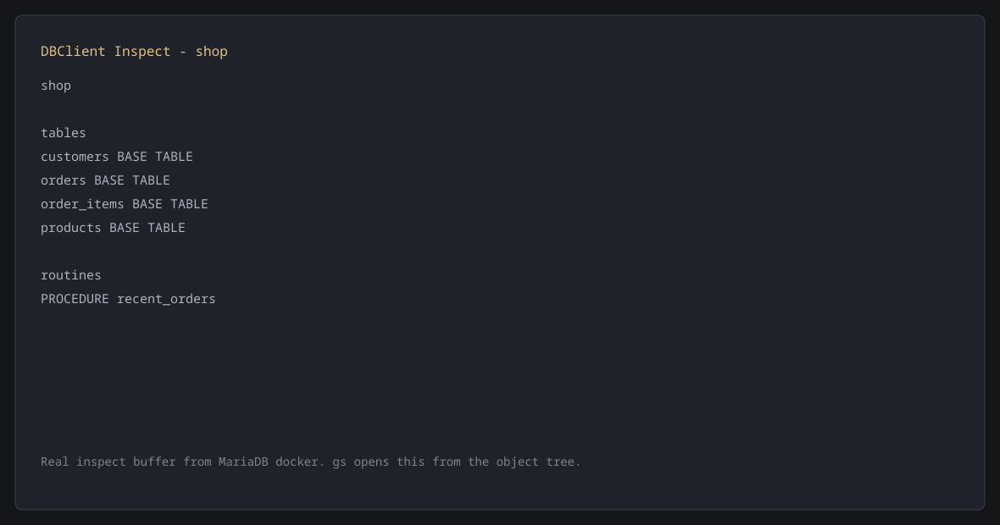

# DBClient.nvim

DBClient.nvim is a Neovim database client with a Lua UI and a Rust core.

Adapters are lazy-loaded, so database-specific code is only loaded when a
configured connection needs it.

## Status

This is an initial implementation intended for publication after more real
database testing. It was built with AI-assisted rapid development, so treat the
current version as early software: useful, inspectable, and moving quickly, but
not yet a mature database client.

## Publishing Plan

DBClient.nvim is being prepared for public release. Before publishing, the main
work is adapter hardening against real MariaDB, PostgreSQL, and SQLite
databases, plus focused tests around cell updates, SSH tunnels, and result
rendering.

## Features

- MariaDB, PostgreSQL, and SQLite adapters through `dbclient-core`.
- SSH local forwarding support for database connections behind a jump host.
- A keyboard-first, Neovim-native database workspace.
- Query execution into scratch result buffers.
- Data preview buffers with explicit primary-key guarded cell updates.
- Schema/object inspection buffers separate from data buffers.
- Procedure/function discovery with query-buffer call seeding.
- Lazy Lua adapter registry and Rust `DbAdapter` implementations.
- Reusable scratch buffers with default Neovim highlight groups.

## Screenshots

These screenshots are generated from a real DBClient session against a
disposable MariaDB Docker container with a sample schema. The SVG sources are
kept beside the PNGs so the captures stay reviewable and easy to regenerate.




## Requirements

- Neovim 0.10 or newer.
- `ssh` on `PATH` when using SSH tunnels.
- MariaDB, PostgreSQL, or SQLite access from the local machine or through SSH
  forwarding where supported by the adapter.

## Installation

With `lazy.nvim`:

```lua
{
  "DorianDevp/dbnvimer",
}
```

DBClient.nvim ships a bundled `dbclient-core` binary in `bin/` and uses it by
default when it matches the current OS and CPU architecture.

Bundled binary names:

- `bin/dbclient-core-linux-x86_64`
- `bin/dbclient-core-linux-aarch64`
- `bin/dbclient-core-macos-x86_64`
- `bin/dbclient-core-macos-aarch64`
- `bin/dbclient-core-windows-x86_64.exe`

## Manual Core Build

If your platform does not have a bundled binary yet, install a Rust stable
toolchain and build the core manually:

```sh
cargo build --release --manifest-path rust/dbclient-core/Cargo.toml
```

Then point DBClient at the built binary in `setup()`:

```lua
require("dbclient").setup({
  core = {
    command = vim.fn.stdpath("data") .. "/lazy/dbnvimer/rust/dbclient-core/target/release/dbclient-core",
  },
})
```

## Setup

```lua
require("dbclient").setup({
  connections = {
    local_mariadb = {
      adapter = "mariadb",
      host = "127.0.0.1",
      port = 3306,
      user = "root",
      password = vim.env.MARIADB_PASSWORD,
      database = "app",
    },
    via_ssh = {
      adapter = "mariadb",
      host = "127.0.0.1",
      port = 3306,
      user = "app",
      password = vim.env.MARIADB_PASSWORD,
      database = "app",
      ssh = {
        host = "bastion.example.com",
        user = "deploy",
        port = 22,
        remote_host = "127.0.0.1",
        remote_port = 3306,
      },
    },
    local_postgres = {
      adapter = "postgres",
      host = "127.0.0.1",
      port = 5432,
      user = "postgres",
      password = vim.env.POSTGRES_PASSWORD,
      database = "app",
    },
    local_sqlite = {
      adapter = "sqlite",
      path = vim.fn.expand("~/data/app.sqlite3"),
    },
  },
})
```

SQLite uses `path` for the database file. PostgreSQL supports the same optional
`ssh` table as MariaDB.

## Commands

- `:DBClient` opens the database sidebar.
- `:DBClientConnect <name>` selects a configured connection.
- `:DBClientQuery` executes the selected SQL or current statement.
- `:DBClientQueryTab` opens or focuses the query buffer.
- `:DBClientData <schema.table>` opens a table preview buffer.
- `:DBClientClose` closes active tunnels.

## Keyboard

- `q` closes DBClient windows.
- `<CR>` opens the item under cursor.
- `o` opens the item under cursor.
- `gd` opens table data for the focused table.
- `gs` opens schema or table inspection.
- `gq` opens or focuses the query buffer.
- `]t` / `[t` jump between visible tables.
- `s` searches visible table names.
- `n` repeats the last table-name match.
- `r` refreshes schemas and tables.
- `e` opens a query buffer for the active connection.
- `F` toggles fullscreen for DBClient windows.
- In data buffers, `]c` / `[c` move cells, `]r` / `[r` move rows, `i` stages a cell edit in a transaction, `I` / `E` updates a cell immediately, and `T` reviews pending transaction changes.
- `<leader>dq` executes SQL from a query buffer.
- `<C-CR>` executes SQL from normal or insert mode in a query buffer.
- `<leader>dc` opens the connection picker.

## Data Buffer Cell Editing

Cell updates require a primary key. In a data buffer, press `i` on a cell to
open an empty edit popup and stage the new value in a pending transaction. Press
`T` to review staged changes, then `c` to commit them in one backend
transaction, `r` to rollback the local changes, or `q` / `<Esc>` to keep
editing.

Press `I` or `E` to edit the current cell and execute the update immediately.
The edit popup starts empty and shows the old value in the popup title. To set a
SQL `NULL`, enter `NULL` without quotes. For date and datetime values, enter the
raw scalar value, for example `2025-05-29` or `2025-05-29 00:00:00`.

## Adapter Shape

Adapters live under `lua/dbclient/adapters/<name>.lua` and are only loaded when
selected. Current adapters:

- `mariadb`
- `postgres`
- `sqlite`

Each adapter returns a table with:

- `connect(connection, config)`
- `close(handle)`
- `schemas(handle)`
- `tables(handle, schema)`
- `columns(handle, schema, table)`
- `routines(handle, schema)`
- `preview(handle, schema, table, limit)`
- `update_cell(handle, schema, table, column, value, pk)`
- `update_cells(handle, updates)`
- `query(handle, sql)`

This keeps DB-specific code outside the UI and lets new adapters remain lazy.
The Rust core mirrors this with a `DbAdapter` trait; DB-specific SQL,
identifier quoting, and value validation live in Rust adapter modules.

## Documentation Log

The git history documents each implementation step with small commits. User
visible behavior is also covered in `doc/dbclient.txt`, and release-level notes
are kept in `CHANGELOG.md`.

## Development Checks

```sh
cargo fmt --manifest-path rust/dbclient-core/Cargo.toml
cargo check --manifest-path rust/dbclient-core/Cargo.toml
nvim --headless -u NONE -i NONE -c "set rtp+=." -c "lua require('dbclient').setup({ connections = {} })" -c "qa"
```

## Screenshot Capture

The README screenshots are generated by `scripts/capture_readme_screenshots.lua`.
It expects a MariaDB instance on `127.0.0.1:13306` with the sample `shop`
schema used for the captures, then drives DBClient in headless Neovim and
rewrites `docs/screenshots/*.svg`. PNG copies are rendered from those SVGs with
`rsvg-convert`.

## Bundled Binary Release

Run the `Bundle core binaries` GitHub Actions workflow manually before tagging a
release. It builds `dbclient-core` on Linux, macOS, and Windows runners, copies
the outputs into `bin/`, and commits changed binaries back to the repository.

After the workflow commit lands:

```sh
git pull
git tag v0.1.0
git push origin v0.1.0
```
