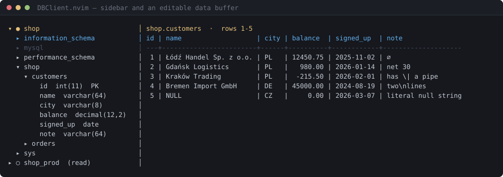
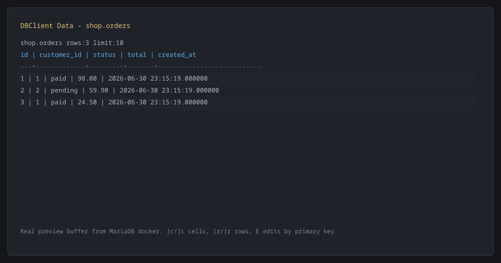
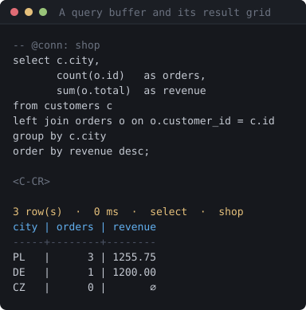

# DBClient.nvim

A database client for Neovim with a Lua front end and a Rust core.

The design principle is that Neovim already knows how to edit text, and a
database client that works with that is better than one that works around it:

- **Result sets are ordinary buffers.** Edit cells with `ciw`, a visual block, a
  macro or `:%s/old/new/g`. `dd` stages a delete, `o` stages an insert, `u` is
  your undo. `:w` turns the difference into `UPDATE` / `INSERT` / `DELETE`,
  shows you the exact SQL, and applies it in one transaction.
- **Schemas are ordinary buffers too.** `gD` opens the real `CREATE TABLE`;
  editing it and writing produces a migration you can read and edit before it
  runs. Comparing two schemas opens Neovim's own diff mode, so `]c` and `dp`
  work without the plugin implementing a diff.
- **Nothing blocks the editor.** A long query keeps running while you work, and
  `<leader>dk` cancels it on the server.
- **No new verbs.** Text objects (`ic`, `ir`, `iC`), the jumplist for foreign
  keys, the quickfix list for reverse lookups, `vim.diagnostic` for SQL errors,
  and `g?` for the keys of whatever buffer you are in.

Supported backends: **MariaDB/MySQL**, **PostgreSQL**, **SQLite**.

## Screenshots

Generated from a real session by `scripts/capture_readme_screenshots.lua`; the
SVG sources sit beside the PNGs so a change in appearance is a readable diff.



Note what the grid is doing: `Łódź`, `Gdańsk` and `Kraków` line up because
widths are counted in display cells; `∅` is a SQL `NULL` while row 5's `NULL` is
the literal string; `has \| a pipe` and `two\nlines` are escaped so a row is
always one line.



`ciw` on a cell, `dd` on a row, then `:w`.



## Status

Early software under active development, built with AI-assisted rapid
development. The core protocol, the editable data buffer and the safety rails
are covered by tests: 102 Rust, 233 Lua including an end-to-end suite driving
real buffers, and 49 adapter tests each against a live PostgreSQL and MariaDB
server. The adapters still want exercising against real production schemas
before a 1.0.

## Installation

With `lazy.nvim`:

```lua
{
  "DorianDevp/dbnvimer",
  build = "cargo build --release --manifest-path rust/dbclient-core/Cargo.toml",
  opts = {},
}
```

The Rust core is a single binary. `opts = {}` is enough to start: DBClient
looks for connections in your project before you configure anything.

## Zero configuration

On startup DBClient scans the project for databases it can already reach:

| source | what it reads |
| --- | --- |
| `.env`, `.env.local` | `DATABASE_URL`, `POSTGRES_*`, `MYSQL_*` |
| `docker-compose.yml` | postgres / mysql / mariadb services, published ports and credentials |
| `config/database.yml` | Rails environments |
| `.dbclient.lua` | a project-local connection table, gated behind a trust prompt |

Detected connections appear in the sidebar marked `project`. Press `y` in the
connection manager to copy one into your own store and edit it.

## Configuration

Connections can be managed entirely from inside the client — `<leader>dC`, then
`a` to add one — and are stored in
`stdpath("data")/dbclient/connections.json` with mode `0600`.

**Passwords are never written to that file.** A connection names where its
secret comes from:

```lua
require("dbclient").setup({
  connections = {
    local_pg = {
      adapter = "postgres",
      host = "127.0.0.1",
      port = 5432,
      user = "postgres",
      database = "shop",
      password_env = "PGPASSWORD",       -- read from the environment
    },

    prod = {
      adapter = "postgres",
      host = "10.0.0.5",
      user = "readonly",
      database = "shop",
      password_cmd = "pass show db/prod", -- read from a command
      access = "read",                    -- refuse anything that is not a read
      color = "red",                      -- every buffer's winbar turns red
      ssh = { host = "bastion" },         -- Host alias from ~/.ssh/config
    },

    staging = {
      adapter = "mariadb",
      host = "127.0.0.1",
      user = "app",
      database = "app",
      password_prompt = true,             -- ask once per Neovim session
      access = "sandbox",                 -- writes run, then always roll back
    },

    notes = { adapter = "sqlite", path = "~/notes.db" },
  },
})
```

### Access levels

| `access` | behaviour |
| --- | --- |
| `write` | the default |
| `read` | the **core** refuses any statement that does not return rows, so a UI bug cannot get around it |
| `sandbox` | writes execute inside a transaction that is always rolled back, so you see what *would* happen |

### Everything else

```lua
require("dbclient").setup({
  core = { command = nil, statement_timeout_ms = nil },
  ui = {
    sidebar_width = 38,
    result_height = 14,
    max_cell_width = 48,
    preview_limit = 200,
    query_limit = 5000,
    null_display = "∅",       -- distinct from the literal text "NULL"
    bool_display = { "true", "false" },
    row_stripes = true,
    winbar = true,
    virtual_fk = true,         -- show `→ users.id` beside foreign keys
    sticky_header = true,      -- keep column names in the winbar when scrolled
  },
  keys = true,                 -- false registers no mappings at all
  detect = { enabled = true },
  store = { enabled = true },
  history = { enabled = true, limit = 1000 },
  guard = {
    confirm_unfiltered_writes = true,
    confirm_destructive = true,
  },
  codegen = {},                -- your own code generators
})
```

Set `vim.g.dbclient_leader` to change the global prefix from `<leader>d`.

## Safety

Running the right statement against the wrong database is the failure mode that
matters, so several things guard against it:

- **Blast radius.** Before an `UPDATE` or `DELETE` that would touch more than
  one row, DBClient rewrites it into the equivalent `SELECT` and shows you the
  rows it is about to change, with the real count from the server:

  ```
  DELETE would affect 14 823 row(s) on prod

    delete from orders where status = 'pending' and created_at < '2025-01-01'

    id    | customer_id | status  | created_at
    ------+-------------+---------+-----------
    10021 | 4           | pending | 2024-11-02
    …and 14 822 more

    <CR> run it    q cancel
  ```

  The rewrite is exact rather than clever: anything it cannot confidently
  rewrite is refused rather than previewed as different rows. `guard
  .preview_writes_over` sets the threshold; `<leader>dR` asks on demand.
- **The server checks your SQL, not a guesser.** Each statement is `PREPARE`d
  and discarded, so unknown columns, wrong types and syntax errors appear as
  `vim.diagnostic` entries — with the server's own message and position —
  without anything being executed.
- A connection with a `color` paints the winbar of **every** buffer bound to it.
- `access = "read"` is enforced in the Rust core, not in the UI.
- `access = "sandbox"` executes and rolls back, reporting what would have
  changed.
- `DELETE`/`UPDATE` without a `WHERE`, and `DROP`/`TRUNCATE`, are flagged as
  `vim.diagnostic` entries as you type and require confirmation before running.
- Writes from the data buffer carry the values they were based on, so an
  `UPDATE` that would silently overwrite someone else's change fails instead.
- Data-buffer writes need a primary key; without one the buffer is read-only.

## Commands

| command | what it does |
| --- | --- |
| `:DBClient` / `:DBClientToggle` | open or toggle the sidebar |
| `:DBClientConnect [name]` | connect, or pick from a list |
| `:DBClientDisconnect [name]` | close one connection |
| `:DBClientConnections` | the connection manager |
| `:DBClientData [schema.]table` | open a table's data buffer |
| `:DBClientQuery` | run the statement at the cursor |
| `:DBClientQueryBuffer` | open the scratch query buffer |
| `:DBClientScratch [sql]` | quick query tab: type, run, read |
| `:DBClientQueries` | browse saved queries |
| `:DBClientSaveQuery [name]` | save the current query |
| `:DBClientTrail` / `:DBClientBack [n]` / `:DBClientForward [n]` | navigation trail |
| `:DBClientExplain[!]` | explain the statement (`!` for `ANALYZE`) |
| `:DBClientBegin` / `:DBClientCommit` / `:DBClientRollback` | session transactions |
| `:DBClientCancel` | cancel the running statement on the server |
| `:DBClientActivity` / `:DBClientLocks` | server session and lock monitors |
| `:DBClientSearch` | fuzzy-find any table or column |
| `:DBClientHistory` / `:DBClientLog` | query history, statement log |
| `:DBClientSchemaDiff` | diff two schemas in Neovim's diff mode |
| `:DBClientDDL schema.object` | open an object's DDL |
| `:DBClientGenerate schema.table [template]` | generate a struct, interface, schema |
| `:DBClientWatch [s] <sql>` | re-run a statement on a timer, highlighting what changed |
| `:DBClientProfile [n] <sql>` | time a statement over several runs |
| `:DBClientBroadcast [sql]` | run one statement on every open connection and compare |
| `:DBClientDiagram [schema]` | Mermaid entity relationship diagram |
| `:DBClientImport schema.table [file]` | import a CSV |
| `:DBClientNotebook` | executable ```sql blocks in this markdown buffer |
| `:DBClientSnapshot` / `:DBClientCompare` | save a result set, diff against a saved one |
| `:DBClientCompareConnections` | run one statement on two connections and diff |
| `:DBClientUndoLog` | writes DBClient made, and the SQL that undoes them |
| `:DBClientPipe <cmd>` | pipe the rows through a shell command |
| `:DBClientIndexes [schema]` | index usage and unused index candidates |
| `:DBClientBlastRadius` | show which rows the statement would change |
| `:DBClientJoin [a b]` | build a join between two tables from the FK graph |
| `:DBClientAudit[!]` | lint the schema (`!` also reads column statistics) |
| `:DBClientChart` | chart the current result set |
| `:DBClientExport [schema.table]` | the export editor |
| `:DBClientExportPreset` | open a saved export preset |
| `:DBClientWorkspaceSave` / `Restore` / `Show` / `Clear` | the open tables and queries for this project |
| `:DBClientHelp` | every mapping in one buffer |
| `:DBClientRestart` | restart the core |

## Keyboard

Press `g?` in any DBClient buffer for the keys that apply there. This section is
generated from the same table that registers the mappings.

<!-- keys:start -->

### Global

Available everywhere; prefixed with `g:dbclient_leader` (default `<leader>d`).

| key | action |
| --- | --- |
| `<leader>dd` | toggle the object sidebar |
| `<leader>dc` | pick a connection |
| `<leader>dC` | manage connections |
| `<leader>dq` | open the scratch query buffer |
| `<leader>dQ` | run the whole query buffer |
| `<leader>ds` | search tables and columns |
| `<leader>dh` | query history |
| `<leader>dl` | statement log for this session |
| `<leader>da` | server activity monitor |
| `<leader>dL` | lock / blocking tree |
| `<leader>dk` | cancel the running statement |
| `<leader>db` | begin a transaction |
| `<leader>dm` | commit the transaction |
| `<leader>dr` | roll back the transaction |
| `<leader>dx` | close the active connection |
| `<leader>dw` | watch a statement on a timer |
| `<leader>dp` | time a statement over several runs |
| `<leader>dB` | run a statement on every connection |
| `<leader>dn` | turn this markdown buffer into a notebook |
| `<leader>du` | writes DBClient made, and how to undo them |
| `<leader>de` | entity relationship diagram for a schema |
| `<leader>di` | import a CSV into a table |
| `<leader>dv` | compare result sets or connections |
| `<leader>d<CR>` | quick query: type SQL, get rows |
| `<leader>df` | saved queries |
| `<leader>dS` | save the current query |
| `<leader>d[` | back along the navigation trail |
| `<leader>d]` | forward along the navigation trail |
| `<leader>dj` | build a join between two tables |
| `<leader>dA` | audit the schema for problems |
| `<leader>dg` | chart the current result set |
| `<leader>dR` | show what the statement would change |
| `<leader>de` | export a table or the last result |

### Sidebar

Object tree: connections, schemas, tables, columns and routines.

| key | action |
| --- | --- |
| `<CR>` | open or toggle the node |
| `o` | open or toggle the node |
| `l` | expand the node |
| `h` | collapse the node or go to its parent |
| `gd` | open table data |
| `gs` | inspect the schema or table |
| `gD` | open the DDL buffer |
| `gq` | open a query buffer |
| `gi` | list indexes |
| `gz` | table and index sizes |
| `ge` | entity relationship diagram |
| `gj` | build a join from this table |
| `gA` | audit this schema |
| `gG` | generate code from this table |
| `gI` | import a CSV into this table |
| `gE` | export this table |
| `gy` | yank the qualified object name |
| `a` | add a connection |
| `c` | edit the connection |
| `x` | delete the stored connection |
| `t` | test the connection |
| `f` | filter the tree |
| `F` | clear the filter |
| `]t` | jump to the next table |
| `[t` | jump to the previous table |
| `r` | refresh the current node |
| `R` | drop the metadata cache and refresh |
| `q` | close the sidebar |
| `g?` | show this help |

### Data buffer

The data buffer is a normal modifiable buffer. Edit cells the way you edit any text: `ciw`, visual block, `:%s/old/new/g`, macros, `dd` to delete a row, `o` to add one. `u` undoes staged changes because it is Neovim's own undo. Writing the buffer with `:w` turns the difference against the fetched snapshot into `UPDATE`, `INSERT` and `DELETE` statements, shows them for confirmation and applies them in one transaction.

Only navigation and inspection are mapped, so nothing shadows an editing key.

| key | action |
| --- | --- |
| `K` | inspect the full cell value |
| `gd` | follow the foreign key under the cursor |
| `gU` | open the rows that reference this one |
| `gu` | list referencing rows in the quickfix |
| `g[` | back along the navigation trail |
| `g]` | forward along the navigation trail |
| `gb` | jump to any point on the trail |
| `gs` | statistics for this column |
| `gS` | sort by this column |
| `gf` | filter rows with a WHERE expression |
| `gF` | clear the filter and sort |
| `gt` | transposed view of this row |
| `gh` | hide this column |
| `gH` | show all columns |
| `gn` | set this cell to SQL NULL |
| `gy` | yank cell, row or selection as... |
| `gp` | duplicate this row as a new INSERT |
| `gr` | reload from the database |
| `gD` | open the DDL for this table |
| `gG` | generate code from this table |
| `gI` | import a CSV into this table |
| `ge` | export this table |
| `]c` | next cell |
| `[c` | previous cell |
| `]r` | next row |
| `[r` | previous row |
| `]p` | next page |
| `[p` | previous page |
| `g?` | show this help |

### Quick query

A tab holding a SQL buffer above its results. Nothing is named or saved until you ask: type, run, read, move on. `<CR>` in normal mode runs the statement under the cursor, so a one-liner is three keystrokes from anywhere.

| key | action |
| --- | --- |
| `<CR>` | run the statement under the cursor |
| `<C-CR>` | run it _(n, i)_ |
| `<leader>dQ` | run every statement |
| `gs` | save this query |
| `gf` | open a saved query |
| `gc` | run against another connection |
| `q` | close the tab |
| `g?` | show this help |

### Query buffer

A real `sql` buffer, so treesitter, completion and your own mappings apply. Statements are split by the core, which understands string literals, comments, dollar quoting and `DELIMITER`.

| key | action |
| --- | --- |
| `<C-CR>` | run the statement at the cursor _(n, i)_ |
| `<leader>dq` | run the statement or selection _(n, v)_ |
| `<leader>dQ` | run every statement in the buffer |
| `<leader>de` | explain the statement |
| `<leader>dE` | explain analyze the statement |
| `<leader>dR` | show which rows this would change |
| `K` | describe the table or column under the cursor |
| `gd` | open the DDL for the table under the cursor |
| `gs` | save this query |
| `gf` | open a saved query |
| `g?` | show this help |

### Saved queries

Saved queries are `.sql` files with a `-- @name:` header, kept per project and globally. They are files, so they grep, diff and commit like anything else.

| key | action |
| --- | --- |
| `<CR>` | open the query |
| `o` | open the query |
| `r` | run it without opening it |
| `n` | write a new query |
| `e` | rename it |
| `x` | delete it |
| `y` | yank the SQL |
| `p` | move between project and global |
| `gr` | rescan the query directories |
| `q` | close the browser |
| `g?` | show this help |

### Export editor

Every export setting as text in a buffer: edit it, `:w` runs it. A preset sets the settings that only make sense together — "for Excel" means a BOM *and* CRLF *and* a semicolon when the locale writes `1,5`.

| key | action |
| --- | --- |
| `gp` | apply a preset |
| `gP` | preview without writing anything |
| `gs` | save these settings as a preset |
| `gr` | run the export |
| `q` | close without exporting |
| `g?` | show this help |

### Result buffer

Read-only grid. `:w name.csv` exports; the format follows the extension.

| key | action |
| --- | --- |
| `K` | inspect the full cell value |
| `gs` | statistics for this column |
| `gt` | transposed view of this row |
| `gy` | yank cell, row or selection as... |
| `ge` | export: formats, encodings, partitioning |
| `gg` | chart these rows |
| `gS` | save this result set as a snapshot |
| `gV` | compare with a saved snapshot |
| `g!` | pipe the rows through a shell command |
| `]c` | next cell |
| `[c` | previous cell |
| `]r` | next row |
| `[r` | previous row |
| `q` | close the result buffer |
| `g?` | show this help |

### DDL buffer

The object's `CREATE` statement as text. Edit it and `:w` to see the migration DBClient would run; nothing reaches the server until you confirm.

| key | action |
| --- | --- |
| `gr` | reload the DDL from the server |
| `gD` | diff against the server version |
| `q` | close the buffer |
| `g?` | show this help |

### Plan buffer

Query plan as a foldable tree. The costliest nodes are highlighted.

| key | action |
| --- | --- |
| `<CR>` | fold or unfold this node |
| `gj` | jump to the most expensive node |
| `gr` | run the plan again |
| `ga` | switch to EXPLAIN ANALYZE |
| `q` | close the plan |
| `g?` | show this help |

### Activity monitor

Live server sessions; refreshes on a timer.

| key | action |
| --- | --- |
| `x` | cancel the statement under the cursor |
| `X` | terminate the session under the cursor |
| `gr` | refresh now |
| `gt` | toggle auto refresh |
| `q` | close the monitor |
| `g?` | show this help |

### Connection manager

Add, edit and test connections without leaving Neovim.

| key | action |
| --- | --- |
| `<CR>` | connect |
| `a` | add a connection |
| `c` | edit the connection |
| `x` | delete the connection |
| `t` | test the connection |
| `y` | copy a detected connection into the store |
| `gr` | rescan the project |
| `q` | close the manager |
| `g?` | show this help |

### Text objects

Available in data and result buffers, in operator-pending and visual mode.

| key | action |
| --- | --- |
| `ic` | inner cell |
| `ac` | a cell, including its separator |
| `ir` | inner row |
| `ar` | a row, including the newline |
| `iC` | inner column, every row of it |
| `aC` | a column, including its separator |

<!-- keys:stop -->

## Walking the relations

A foreign key is an edge, so following one should feel like following a link.

- `gd` on a foreign key cell opens the referenced row.
- `gU` goes the other way: the rows in other tables that reference this one.
- `gu` puts every referencing table into the quickfix list with counts.

Because a graph walk is rarely one step, each place you land is recorded on a
**trail**: the table plus the filter, sort and page you were looking at.

```
main.customers › main.orders › [main.customers[id = 1]]
```

- `g[` back, `g]` forward — with a count, so `2g[` goes from `z` straight to `x`
- `gb` opens the whole trail and jumps to any point in it
- the breadcrumb sits in the winbar, so you always know where you are

Navigating from a rewound position drops the forward branch, the way a browser
does. Restoring a place reconstructs the view rather than hoping a buffer
survived, so going back to an unfiltered table really is unfiltered.

## Quick queries and saved queries

`<leader>d<CR>` opens a **quick query tab**: a SQL buffer above its results.
Nothing is named or saved until you ask — type, `<CR>`, read, move on. `gs`
promotes whatever is in it to a saved query without retyping it.

`<leader>df` opens the **saved queries** browser. Saved queries are `.sql` files
with a small header:

```sql
-- @name: overdue invoices
-- @conn: staging
-- @desc: everything unpaid past its due date
-- @tags: billing, support

select * from invoices where paid_at is null and due_at < now();
```

They live in two places and `p` moves one between them:

| scope | where | who |
| --- | --- | --- |
| project | `.dbclient/queries/` in the repository | the team, through git |
| global | `stdpath("data")/dbclient/queries/` | you |

Being files means they grep, diff, review and commit like everything else.

## Notebooks

`:DBClientNotebook` turns a Markdown buffer into one where ```sql blocks run
with `<CR>` and write their answer back underneath as a table:

````markdown
<!-- @conn: staging -->

## Why did revenue drop in March?

```sql
select date_trunc('month', placed_at) as month, sum(total)
from orders group by 1 order by 1;
```
<!-- dbclient:result -->
`3 row(s) in 12 ms`

| month | sum |
| --- | ---: |
| 2026-01-01 | 1200.50 |
| 2026-02-01 |  210.00 |
| 2026-03-01 | 1255.25 |
<!-- dbclient:end -->
````

Re-running a block replaces its result rather than stacking another one, so the
document stays a document. It is a file, so it commits alongside the incident
it explains.

## The data buffer

Opening a table gives you a normal modifiable buffer:

```
shop.customers  ·  rows 1-200 of 4123  ·  order by id asc
id  | name    | city | note
----+---------+------+-----------
1   | Łódź    | PL   | ∅
2   | NULL    | DE   | literal null
3   | Kraków  | PL   | has \| pipe
4   | Gdańsk  | ∅    | two\nlines
```

Things worth knowing:

- `∅` is a SQL `NULL`. The literal text `NULL` renders as itself, and both
  survive a round trip through the buffer.
- Values containing a newline, a tab or the column separator are escaped
  (`\n`, `\t`, `\|`) so a row is always one line, and unescaped on write.
- Column widths are measured in display cells, so `Łódź` and CJK text line up.
- A cell too wide to show is truncated with `…`; editing a truncated cell is
  **refused** rather than silently shortening the stored value. Use `K` to edit
  the whole value instead.
- Row identity is tracked with extmarks and reconciled against the primary key,
  so reordering, deleting and line-wise edits attribute changes to the right
  row.
- `:w` shows the summary *and* the exact SQL, generated by the same code that
  will run it, before anything is applied.

## Query buffers

A query buffer is a real `sql` buffer. Statements are split by the Rust core,
which understands string literals, `--` and `/* */` comments, PostgreSQL dollar
quoting and MySQL's `DELIMITER`, so a semicolon inside a string or a stored
procedure body does not split a statement.

A `-- @conn: name` header binds a `.sql` file to a connection, so a directory of
per-environment queries can live in the repository.

`K` describes the table or column under the cursor from the cached schema, `gd`
opens its DDL, and completion (`omnifunc`, plus an `nvim-cmp` source when cmp is
installed) offers tables, columns and routines.

## Workspaces

`:DBClientWorkspaceSave` records which connections are open, which tables you
had open with their filters and sorts, and the contents of your query buffers,
keyed by working directory. It is saved automatically on exit;
`:DBClientWorkspaceRestore` brings it back. `:mksession` cannot help here —
restoring a data buffer means reconnecting and re-running its query, not
restoring bytes.

## Export

Every client can write a CSV. What they get wrong is everything around it, so
this part is deliberately opinionated.

`ge` on a result or a table opens the **export editor** — every setting as text
in a buffer, `:w` runs it, `gP` shows the first lines without writing anything.
A wizard hides the settings that matter; a buffer shows them all at once and
saves as a file, which is what turns a one-off into a preset.

| gap in other clients | what happens here |
| --- | --- |
| NULL and an empty string both become nothing in CSV | the NULL sentinel is configurable (`\N`, `NULL`, empty) and **written bare even under `quoting = all`**, so `""` means empty and nothing means NULL — and the manifest records which was used |
| Excel mangles non-ASCII, or splits `1,5` into two columns | the `excel` preset sets a UTF-8 BOM *and* CRLF *and* moves the delimiter to `;` when the decimal separator is a comma. One setting alone does not fix it |
| the whole result set is loaded into memory | rows stream from a server-side cursor and are written as they arrive, so 5 million rows costs the same memory as 5 |
| a JSON column is embedded as an escaped string | it is inlined, so the output is one document instead of a document full of documents. `json_columns` names them where the backend has no JSON type |
| an export is unrepeatable and unexplainable | a sidecar manifest records the statement, columns and types, row count, every setting that affects how the bytes read back, and a SHA-256 per file |
| one enormous file | split every N rows, or into one file per value of a column — per-day, per-tenant — without a shell loop |
| no compression | gzip on the way out |
| sensitive columns go out in the clear | `redact` masks named columns as they are written |
| numbers become text in a spreadsheet | XLSX is written for real: numbers stay numeric so `SUM` works, `007` stays text, the header row is frozen |
| you find out it was wrong after writing 2 GB | `gP` previews the first rows, and an existing file is refused unless `overwrite` is set |

Formats: `csv`, `tsv`, `json`, `jsonl`, `markdown`, `html`, `xml`, `sql`, `xlsx`,
`text`. Presets: `excel`, `csv_strict`, `postgres_copy`, `mysql_load`, `api`,
`backup`, `spreadsheet`, `report`, `archive`, `share`.

The SQL format is not just `INSERT`: batched multi-row statements, an optional
surrounding transaction, dialect-correct quoting and escaping, and `upsert` /
`ignore` / `replace` modes — with `sql_key_columns` for the conflict target,
because PostgreSQL cannot upsert without one and guessing would be worse than
saying so.

`:w report.csv` on a result buffer still works for the simple case; the editor
is for when the details matter.

## Understanding a schema

**`:DBClientJoin`** answers "how do I get from `orders` to `countries`" by
searching the foreign key graph and writing the query:

```sql
select o.*
from shop.orders o
join shop.customers c on c.id = o.customer_id
join shop.addresses a on a.id = c.address_id
join shop.countries c2 on c2.id = a.country_id
limit 100;
```

Several routes are offered when several exist, shortest first, and edges are
followed in either direction because a join does not care which side holds the
key.

**`:DBClientAudit`** lints the schema from metadata that is already cached:

| finding | why it matters |
| --- | --- |
| no primary key | rows cannot be addressed individually, so the data buffer is read-only |
| foreign key with no index | every parent delete becomes a scan |
| index that is a prefix of another | dead weight, unless it is unique |
| foreign key whose types disagree | the join will not use an index |

With `!` it also reads column statistics and reports columns that are NULL in
every row, nullable columns that are never NULL, and columns holding one value.
Findings go to the quickfix list, so `]q` walks them.

**`:DBClientChart`** draws the current result set:

```
2026-01  ████████████████████████████████████████████  1 200.50
2026-02  ███████▊                                        210.00
2026-03  ██████████████████████████████████████████████ 1 255.25

3 point(s)   min 210   max 1255.25   █▁█
```

Negative values are drawn either side of a zero line rather than rescaled, and
a column whose type the backend never declared — `count(*)` in SQLite — is
charted anyway if its values are numbers.

## Requirements

- Neovim 0.10 or newer (0.11+ recommended)
- A Rust toolchain to build the core, or a bundled binary for your platform
- `ssh` on `PATH` for tunnels

Run `:checkhealth dbclient` to verify all of the above, including that the core
binary's protocol version matches the plugin's.

## Development

```sh
# Rust: format, lint, test
cargo fmt --manifest-path rust/dbclient-core/Cargo.toml
cargo clippy --manifest-path rust/dbclient-core/Cargo.toml -- -D warnings
cargo test --manifest-path rust/dbclient-core/Cargo.toml

# Lua: unit and end-to-end tests (needs the core built)
cargo build --release --manifest-path rust/dbclient-core/Cargo.toml
nvim --headless -u NONE -i NONE -c "luafile tests/run.lua"

# Protocol smoke test over stdio
python3 scripts/protocol_smoke.py

# Regenerate the documentation from the mapping table
nvim --headless -u NONE -c "luafile scripts/generate_docs.lua"
```

## Architecture

```
lua/dbclient/
  core/client.lua      async JSON-RPC client for the daemon
  session.lua          many live connections, each with its own metadata cache
  keymap.lua           every mapping, once; g? and the docs are generated from it
  connections/         registry, store, project detection, manager UI
  data/diff.lua        buffer text -> change set (pure, tested)
  ddl/migrate.lua      DDL text -> migration (pure, tested)
  ui/grid.lua          reversible grid rendering (pure, tested)
  ui/…                 sidebar, data, query, results, ddl, explain, activity

rust/dbclient-core/
  server.rs            the daemon: one thread and one connection per session
  session.rs           the DbSession trait, access control, value classes
  sqlparse.rs          dialect-tolerant statement splitter
  adapters/            mariadb, postgres, sqlite
  tunnel.rs            SSH forwarding with a retained child process
```

The core is one long-lived process hosting many sessions. That is what makes
real transactions, server-side cancellation, and non-blocking queries possible;
the previous design spawned a process and opened a connection per command.

## License

MIT
